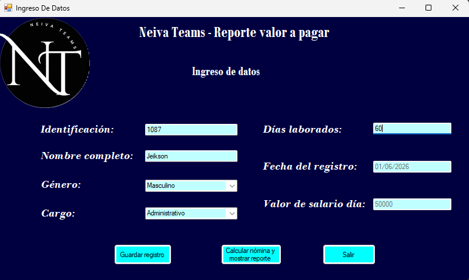
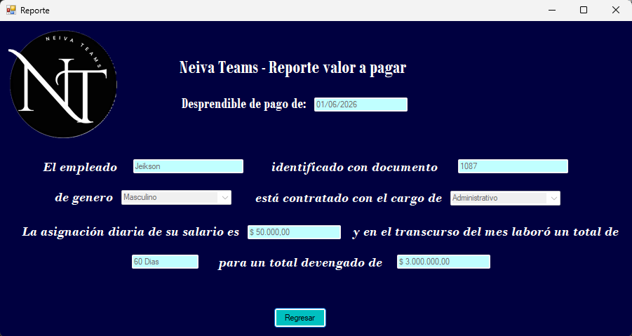

# 💼 Sistema de Gestión de Nómina en C#

## Descripción

Proyecto académico desarrollado en C# utilizando Windows Forms para la gestión básica de nómina de empleados.

La aplicación permite registrar información de trabajadores, seleccionar su cargo, calcular automáticamente el salario devengado según los días laborados y generar un reporte con los datos registrados.

El proyecto fue desarrollado aplicando conceptos de programación orientada a objetos, validación de datos y diseño de interfaces gráficas de escritorio.

---

## Objetivos

- Registrar información básica de empleados.
- Calcular automáticamente el salario devengado.
- Aplicar conceptos de Programación Orientada a Objetos (POO).
- Implementar validaciones para el ingreso de datos.
- Generar reportes con la información registrada.

---

## Tecnologías Utilizadas

- C#
- .NET Framework
- Windows Forms
- Programación Orientada a Objetos (POO)
- Visual Studio

---

# Funcionalidades

## Registro de empleados

La aplicación permite registrar:

- Identificación
- Nombre
- Género
- Cargo
- Días laborados
- Fecha de registro

---

## Gestión de cargos

Se implementó una lista de cargos predefinidos con su respectivo salario diario:

| Cargo | Salario Diario |
|---------|--------------:|
| Electricista | $60.000 |
| Mecánico | $65.000 |
| Soldador | $70.000 |
| Servicios Generales | $40.000 |
| Administrativo | $50.000 |

Al seleccionar un cargo, el sistema asigna automáticamente el salario correspondiente.

---

## Cálculo de nómina

El salario devengado se calcula mediante la siguiente fórmula:

```text
Salario Devengado = Días Laborados × Salario Diario
```

Ejemplo:

```text
20 días × $60.000 = $1.200.000
```

---

## Validación de datos

La aplicación incorpora validaciones para garantizar la integridad de la información ingresada:

- Campos obligatorios.
- Restricción de caracteres no numéricos en identificación.
- Restricción de caracteres no numéricos en días laborados.
- Verificación de datos antes de guardar registros.

---

## Generación de reporte

Una vez registrados los datos del empleado, el sistema genera un reporte que muestra:

- Información personal.
- Cargo seleccionado.
- Días laborados.
- Salario diario.
- Salario devengado calculado.

---

# Capturas de Pantalla

## Formulario de ingreso de datos



---

## Reporte generado



---

# Estructura del Proyecto

```plaintext
source/
└── Fase2JeiksonBedoya/
    ├── Program.cs
    ├── Nomina.cs
    ├── IngresoDeDatos.cs
    ├── Reporte.cs
    └── Archivos del formulario Windows Forms
```

---

# Componentes Implementados

## Clase Nomina

La clase principal almacena la información de cada empleado:

- Identificación
- Nombre
- Género
- Cargo
- Días laborados
- Fecha de registro
- Salario diario

Además, incorpora un método para calcular el salario devengado.

---

## Método de cálculo

```csharp
public double SalarioDevengado(double DiasLaborados, double SalarioDia)
{
    double valorDevengado = DiasLaborados * SalarioDia;
    return valorDevengado;
}
```

---

# Resultados Obtenidos

- Implementación de una aplicación funcional de escritorio.
- Aplicación práctica de Programación Orientada a Objetos.
- Desarrollo de interfaces gráficas con Windows Forms.
- Implementación de validaciones para el ingreso de datos.
- Automatización del cálculo de nómina.
- Generación automática de reportes para usuarios.

---

# Aprendizajes Adquiridos

Durante el desarrollo del proyecto se fortalecieron conocimientos relacionados con:

- Programación en C#.
- Diseño de interfaces gráficas.
- Eventos y controles de Windows Forms.
- Validación de entradas.
- Métodos y clases.
- Programación Orientada a Objetos.
- Desarrollo de aplicaciones de escritorio.

---

## Autor

**Jeikson Bedoya Gómez**

Proyecto desarrollado como parte de la formación en Ingeniería de Sistemas.
